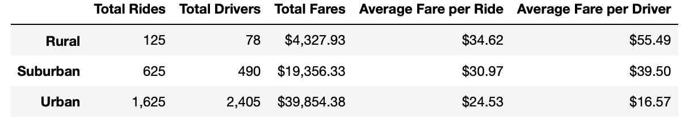

# Pyber_Analysis

The purpose of this assignment was to create a summary DataFrame of the key metrics for the ride-sharing data by city type and creating a multiple-line graph that shows the total fares for each week by each city type. This is some follow up work what has been requested by the CEO. The CEO has also asked us to analyze the results. All the data was derived from 2 excel sheets that were provided to us earlier in the module. These 2 excel files were merged into a dataframe where I used the groupby() function to create the summary dataframe:

