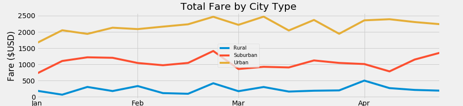

# Pyber_Analysis

The purpose of this assignment was to create a summary DataFrame of the key metrics for the ride-sharing data by city type and creating a multiple-line graph that shows the total fares for each week by each city type. This is some follow up work what has been requested by the CEO. The CEO has also asked us to analyze the results. All the data was derived from 2 excel sheets that were provided to us earlier in the module. These 2 excel files were merged into a dataframe where I used the groupby() function to create the summary dataframe:

insights from the summary:
- Total rides: Urban rides is the clear winner here, with suburban and rural far behind.
- Total Drivers: The order is the same as total rides
- total fares: The order is the same as total rides
- Average fare per ride: Rural comes in first, then suburban, then urban
- avg fare per driver: same as avg fare per ride
One strange thing to note is that total drivers for the urban district outnumbers the total rides. Urban districts do a much larger portion of all the rides, but also make a lot less per trip and driver than the others. The rural averages may be this high due to the increased distances and decreased supply of drivers.

After I created the summary, I worked on creating a line graph from the same merged data set. I set the index to the date by using the info() method, and then created a pivot data table. I also created weekly buckets for the dates to make it more organized and better for charting purposes.

insights from the chart:
- this chart only looks at fare by city type, which is very limited
- it shows the same thing as the district summary. Urban fares are the highest, followed by suburban, than rural. 
- each sector seems to be somewhat correlate to each other in terms of time of the year. On of the big differences is the suburban pick up in fares from Apr to May.

When i first started looking at this data, I had a tough time figuring out how to look at each district separately. I was trying to create a dataframe for each region, then run the analysis, and then create a summary off of that information. I was overcomplicating the issue, and had to take a step back. I was able to get all the information I needed from the 2 merged files simply by using variables that filtered the information that i needed. Then i was able to use the variables to create the the summary.

I believe we have a lot of incomplete data so it makes it hard to provide any real recommendations. In this dataset, the rural drivers make significantly more than the other districts. This could be misleading as we do not know the true cost per mile of operating the car. I am assuming that more rural rides will have significantly higher mileages for the routes itself, and in between passenger pickups as well. Will these routes still be as profitable in relation to the other districts one we factor in the added cost of fuel, maintenance, wear and tear etc?
Total fares seems to not be a very useful number to look at, unless all the cost of operation is shifted on the driver (is the case for all the rideshare apps). I would also like to see a more complete data set that stretched multiple years, this short term market snapshot could be very misleading. One piece of data that we also could have looked at is the ratio of total rides to drivers. Rural has 1.6, suburban 1.27, and urban 0.68 per driver. I would recommend limiting the amount of drivers that we have out there in certain areas so that we can raise the average fare pre driver. Especially in the urban areas where the drivers massively outnumber the total rides. One area I could also look at is where most rides are originating, and where the destinations are. We can create a dataframe from all this information, and count the frequency of each destination. We can piggyback off of all the previous work we have done. We can build a dataframe for the most used locations and map their frequency in a chart. The groupby() function would work well for this data. This could give us insight in to where we need to focus our drivers. 

